<p align="center">
  
</p>

<div align="center">
  
  <a href="https://discord.gg/p5KBs5cHsX"></a>
  <br>
  <a href="https://ko-fi.com/llayer"></a>
</div>

# LSX4

LSX4 is an open-source PlayStation 4 emulator application for Android.

LSX4 does not include games, firmware, or other copyrighted system content.

Development also makes use of current-generation large language models (LLMs).

## Download

<p align="center">
  <a href="https://play.google.com/store/apps/details?id=com.jetcalls.lsx4"></a>
</p>

## Implementation architecture

LSX4 is split into three main parts:

- The Android application handles the game library, settings, input, lifecycle,
  and the rendering surface.
- The native execution runtime runs PS4 x86-64 code on AArch64 Android devices.
- Funnel ARM provides the loader, HLE services, shader translation, and Vulkan GPU
  emulation used by the runtime.

### Guest CPU execution

The standard Android runtime uses LSX4's own in-process x86-64 to AArch64 JIT
compiler. It does not boot a Linux userland, run the game in a Linux container, or
hand guest execution to an external whole-process translator. The PS4 executable is
mapped directly by the native runtime, while the loader and HLE layer provide the
kernel and system services expected by the game.

For each guest code region, iced-x86 is used only to decode x86-64 instructions.
LSX4 converts the decoded instructions into its own instruction model and operation
IR, applies the guest semantics, and emits executable AArch64 blocks into an
LSX4-managed code arena. Calls from compiled guest code into emulated system
services use the LSX4 invocation ABI rather than a Linux syscall layer.

The instruction model, operation IR, AArch64 code generator, executable code cache,
block linker, tiering system, and invalidation logic are implemented in LSX4. The
baseline tier compiles native blocks synchronously. Hot blocks are recompiled at the
next tier, and stable hot paths can be combined into guarded traces. Direct edges
connect known block targets, indirect-target caches handle dynamic branches, and a
dispatcher fallback resolves targets that have not been compiled yet.

Guest-byte fingerprints and page revisions are checked before published code is
reused. If self-modifying guest code changes a mapped page, LSX4 retires the stale
translation and compiles a new version. Versioned artifacts retain a safe rollback
target when a trace guard fails or a newer translation is invalidated.

### Runtime documentation

[`ARCHITECTURE.md`](ARCHITECTURE.md) describes the runtime boundaries and links each
component to its source files. [`docs/architecture.yaml`](docs/architecture.yaml)
contains the same information in a machine-readable format.

## Current development priorities

- Improving performance in playable games.
- Expanding title compatibility by resolving frontiers and invariants.
- Implementing Mali support and improving performance on Mali devices.
- Increasing the number of playable titles by testing currently untested games.

## Playable games

Tested on devices powered by Snapdragon 8 Gen 3 and Snapdragon 8 Gen 5.

### Video demonstrations

<p align="center">
  <a href="https://www.youtube.com/watch?v=CQpTIQlKarM"></a>
  <a href="https://www.youtube.com/watch?v=4UmC0u8DJmY"></a>
</p>

### Device previews (102 playable games)

<table>
  <tr>
    <td align="center" width="50%"><br><sub><b>Bloodborne</b></sub></td>
    <td align="center" width="50%">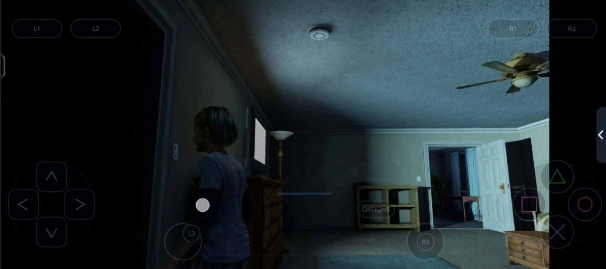<br><sub><b>The Last of Us Remastered</b></sub></td>
  </tr>
  <tr>
    <td align="center" width="50%">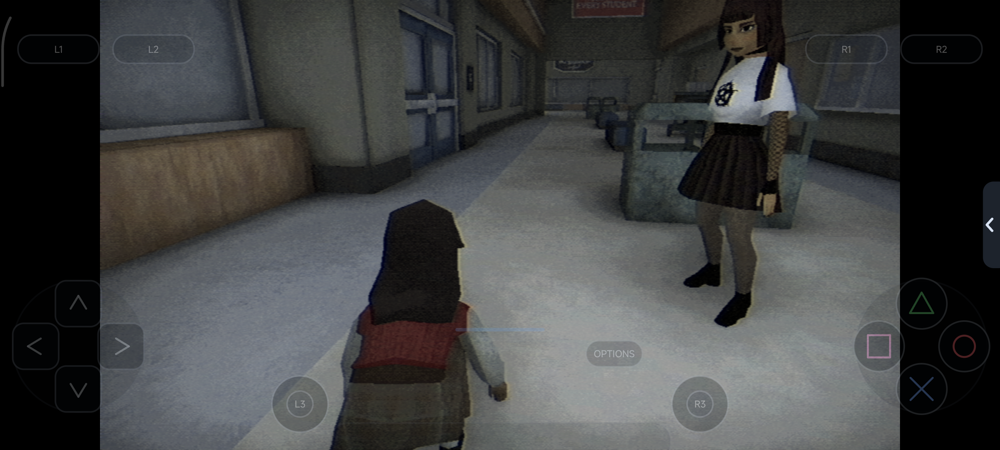<br><sub><b>Fear The Spotlight</b> · Poco Snapdragon 8 Gen 3</sub></td>
    <td align="center" width="50%"><br><sub><b>INSIDE</b></sub></td>
  </tr>
  <tr>
    <td align="center" width="50%">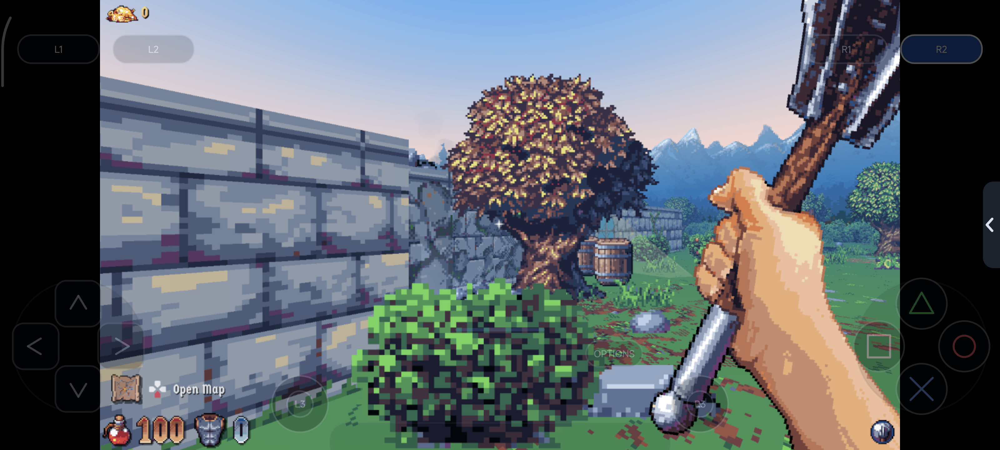<br><sub><b>Wizordum</b> · Poco Snapdragon 8 Gen 3</sub></td>
    <td align="center" width="50%">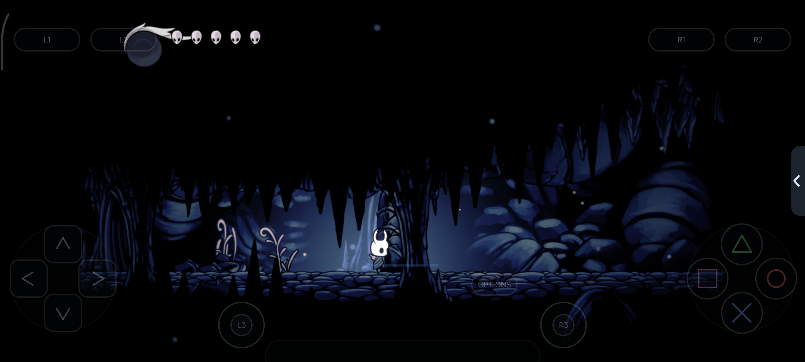<br><sub><b>Hollow Knight</b> · Poco Snapdragon 8 Gen 3</sub></td>
  </tr>
  <tr>
    <td align="center" width="50%">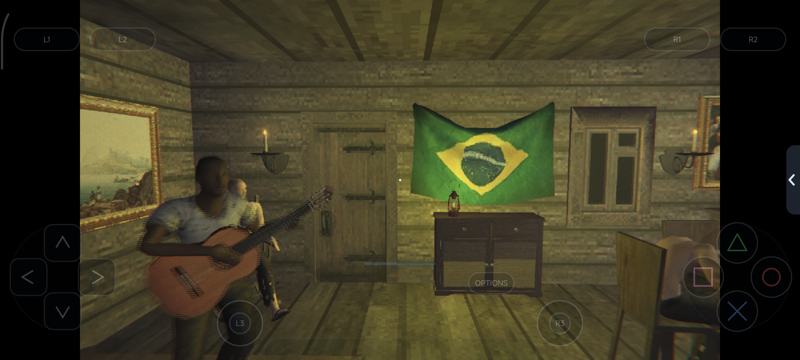<br><sub><b>Mortisomem</b> · Poco Snapdragon 8 Gen 3</sub></td>
    <td align="center" width="50%">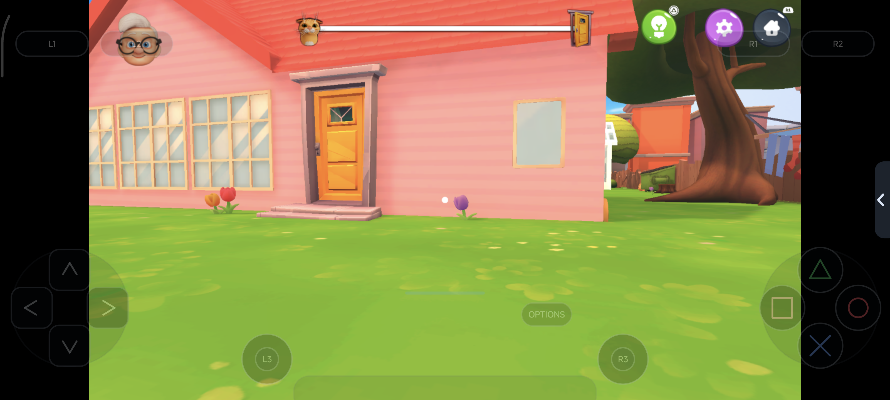<br><sub><b>Cat From Hell 2</b> · Poco Snapdragon 8 Gen 3</sub></td>
  </tr>
  <tr>
    <td align="center" width="50%">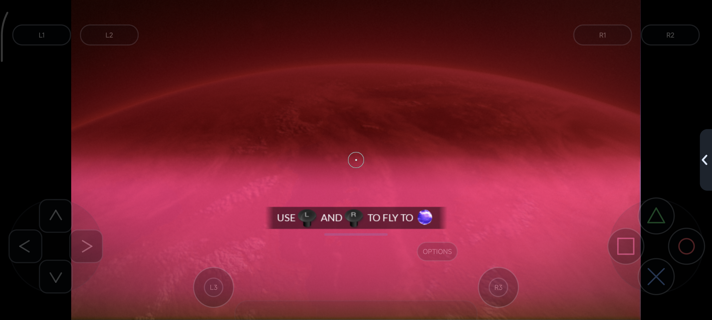<br><sub><b>Megaton Rainfall</b> · Poco Snapdragon 8 Gen 3</sub></td>
    <td align="center" width="50%"><br><sub><b>Trine</b></sub></td>
  </tr>
  <tr>
    <td align="center" width="50%">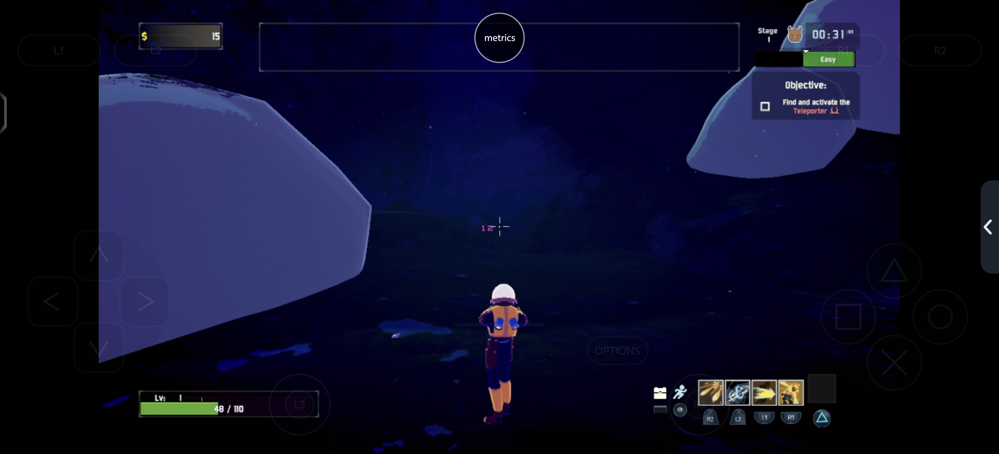<br><sub><b>Risk of Rain 2</b></sub></td>
    <td align="center" width="50%">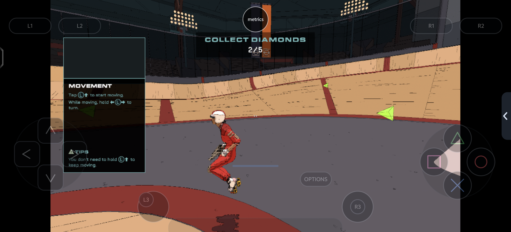<br><sub><b>Rollerdrome</b></sub></td>
  </tr>
  <tr>
    <td align="center" width="50%">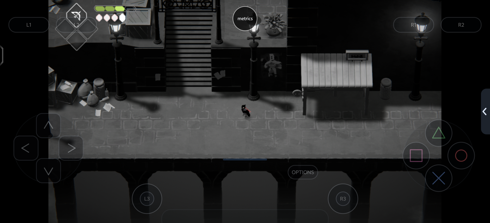<br><sub><b>Death's Door</b></sub></td>
    <td align="center" width="50%"><br><sub><b>DREDGE</b></sub></td>
  </tr>
  <tr>
    <td align="center" width="50%">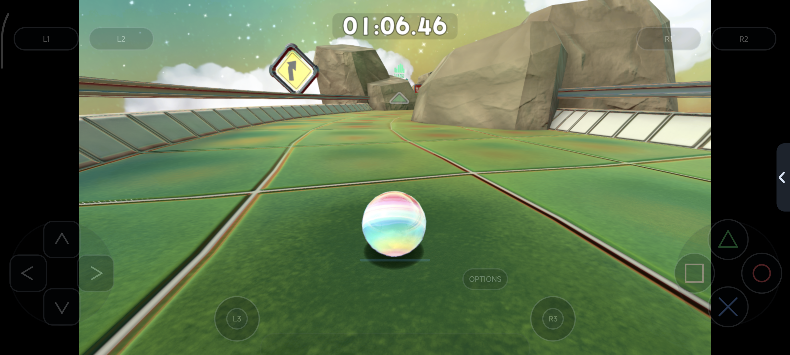<br><sub><b>Marble It Up! Ultra</b> · Poco Snapdragon 8 Gen 3</sub></td>
    <td align="center" width="50%"><br><sub><b>The Gardens Between</b></sub></td>
  </tr>
  <tr>
    <td align="center" width="50%"><br><sub><b>The Pedestrian</b></sub></td>
    <td align="center" width="50%">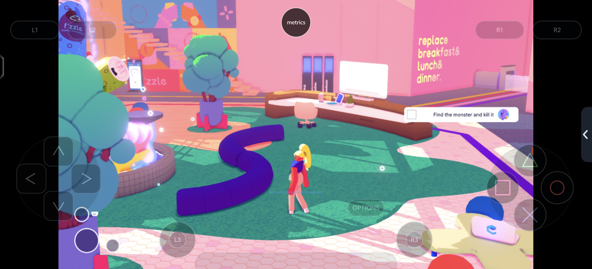<br><sub><b>Going Under</b></sub></td>
  </tr>
  <tr>
    <td align="center" width="50%"><br><sub><b>FAR: Lone Sails</b></sub></td>
    <td align="center" width="50%">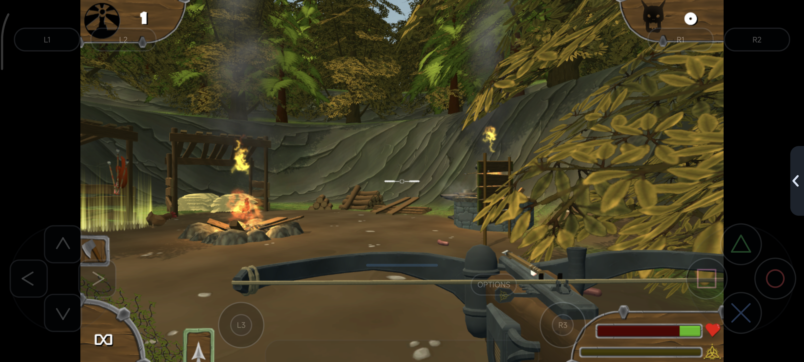<br><sub><b>Orc Slayer</b> · Poco Snapdragon 8 Gen 3</sub></td>
  </tr>
  <tr>
    <td align="center" width="50%"><br><sub><b>Jazzpunk: Director's Cut</b></sub></td>
    <td align="center" width="50%"><br><sub><b>MediEvil</b></sub></td>
  </tr>
  <tr>
    <td align="center" width="50%">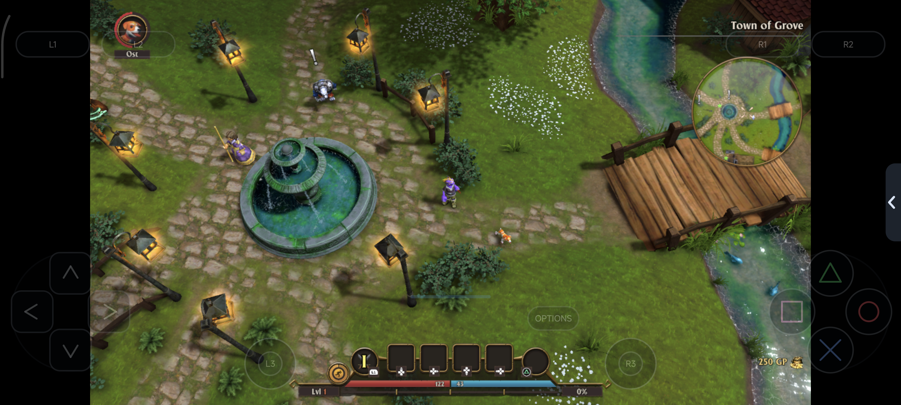<br><sub><b>FATE Reawakened</b> · Poco Snapdragon 8 Gen 3</sub></td>
    <td align="center" width="50%">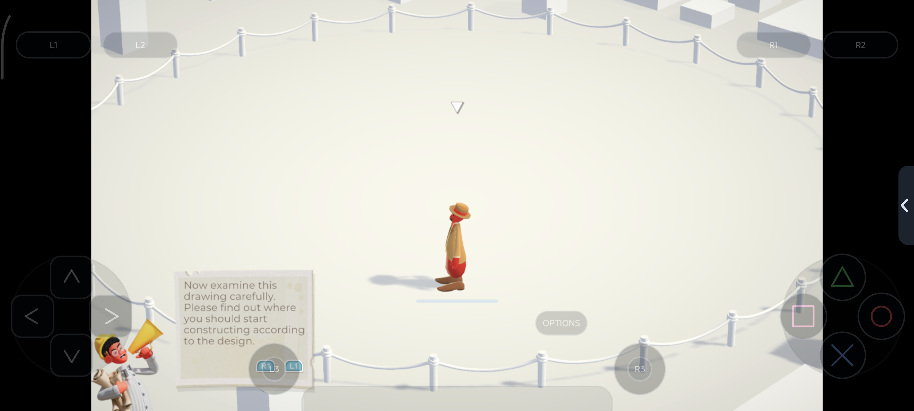<br><sub><b>Buildest</b> · Poco Snapdragon 8 Gen 3</sub></td>
  </tr>
  <tr>
    <td align="center" width="50%">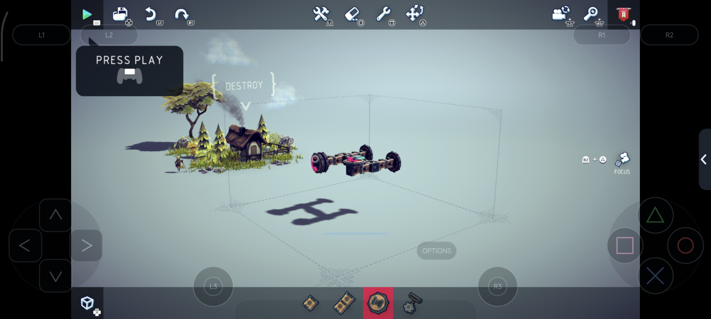<br><sub><b>Besiege</b> · Poco Snapdragon 8 Gen 3</sub></td>
    <td align="center" width="50%">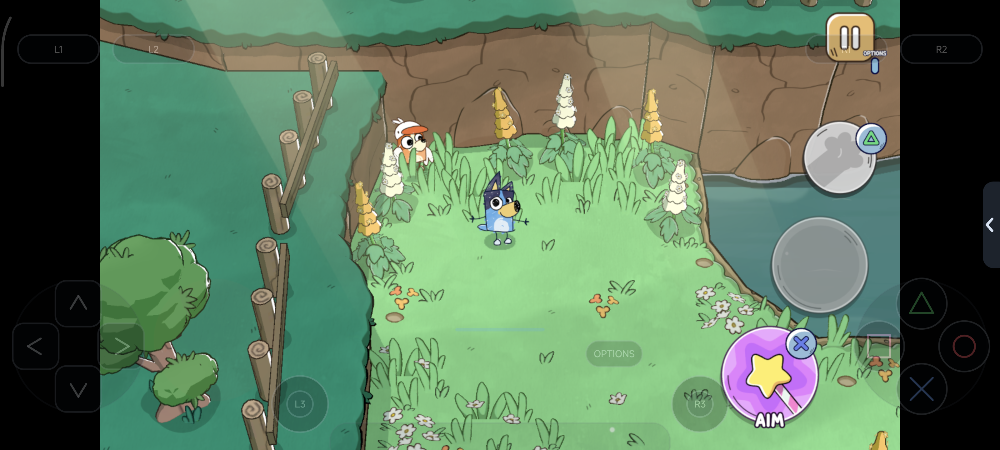<br><sub><b>Bluey&#x27;s Quest for the Gold Pen</b> · Poco Snapdragon 8 Gen 3</sub></td>
  </tr>
  <tr>
    <td align="center" width="50%">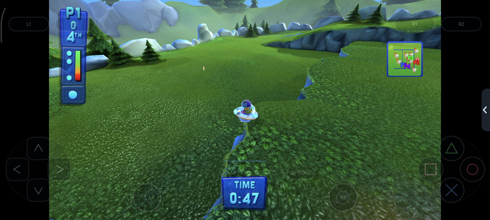<br><sub><b>Fluster Cluck</b></sub></td>
    <td align="center" width="50%">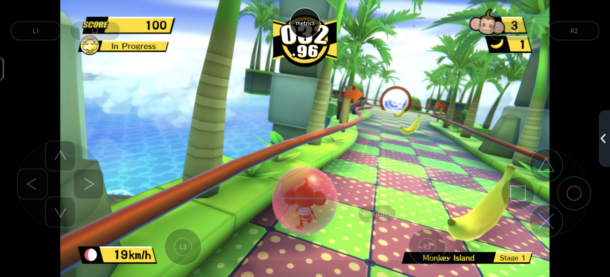<br><sub><b>Super Monkey Ball: Banana Blitz</b></sub></td>
  </tr>
  <tr>
    <td align="center" width="50%">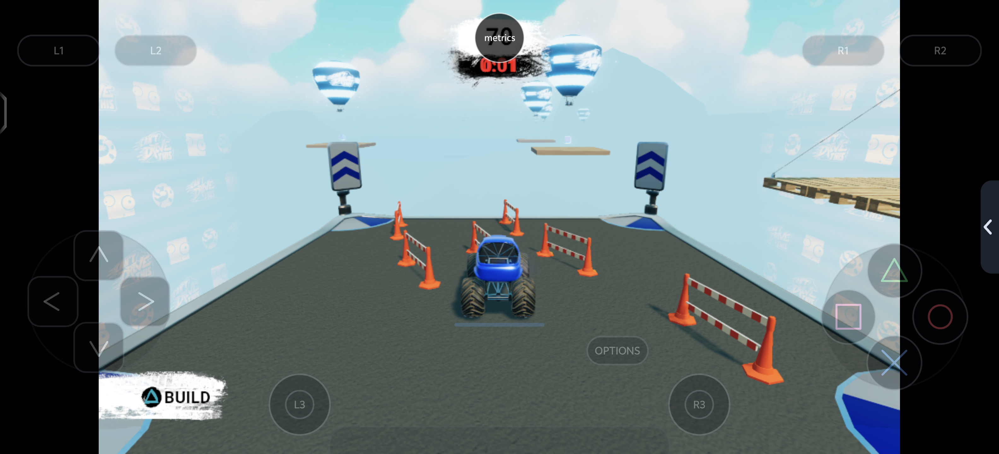<br><sub><b>Can&#39;t Drive This</b></sub></td>
    <td align="center" width="50%"><br><sub><b>A Short Hike</b></sub></td>
  </tr>
</table>

<details>
<summary>Show more gameplay screenshots</summary>

<table>
  <tr>
    <td align="center" width="50%"><br><sub><b>Old Man's Journey</b></sub></td>
    <td align="center" width="50%"><br><sub><b>Nubla</b></sub></td>
  </tr>
  <tr>
    <td align="center" width="50%"><br><sub><b>Bonfire Peaks</b></sub></td>
    <td align="center" width="50%">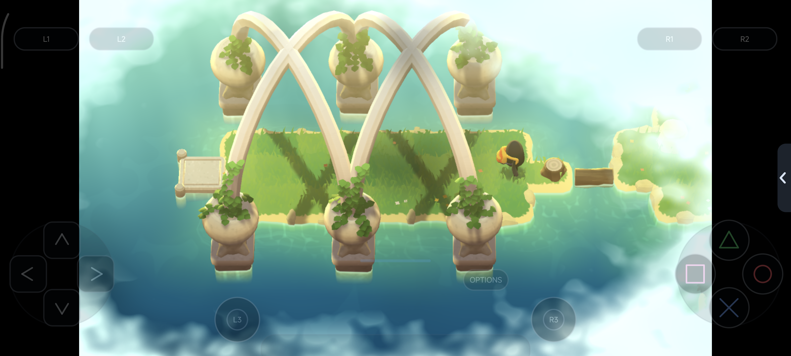<br><sub><b>A Monster&#x27;s Expedition</b> · Poco Snapdragon 8 Gen 3</sub></td>
  </tr>
  <tr>
    <td align="center" width="50%"><br><sub><b>MEGALAN 11</b></sub></td>
    <td align="center" width="50%"><br><sub><b>Grand Prix RockN Racing</b></sub></td>
  </tr>
  <tr>
    <td align="center" width="50%"><br><sub><b>Rock 'N Racing Off Road DX</b></sub></td>
    <td align="center" width="50%">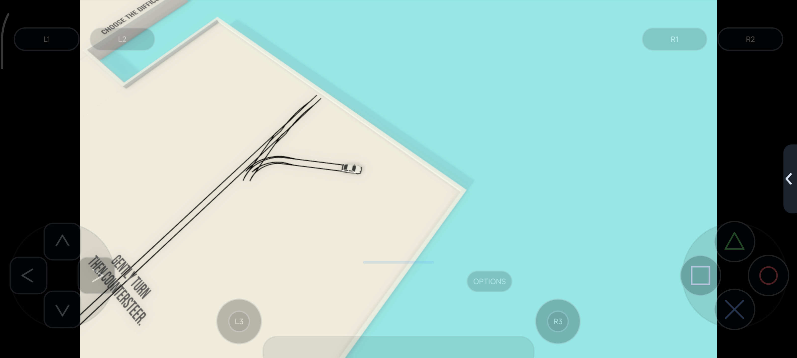<br><sub><b>Absolute Drift</b> · Poco Snapdragon 8 Gen 3</sub></td>
  </tr>
  <tr>
    <td align="center" width="50%">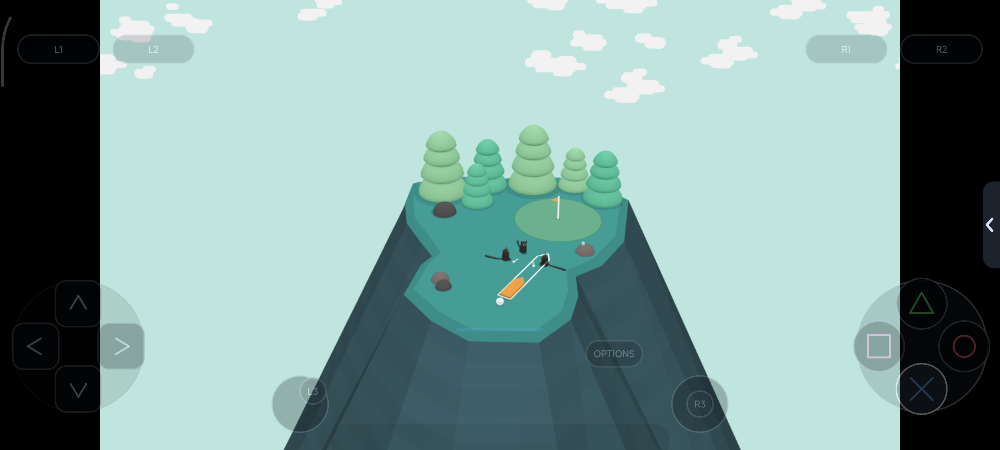<br><sub><b>WHAT THE GOLF?</b> · Poco Snapdragon 8 Gen 3</sub></td>
    <td align="center" width="50%"><br><sub><b>Lethal League Blaze</b></sub></td>
  </tr>
  <tr>
    <td align="center" width="50%"><br><sub><b>RESOGUN</b></sub></td>
    <td align="center" width="50%">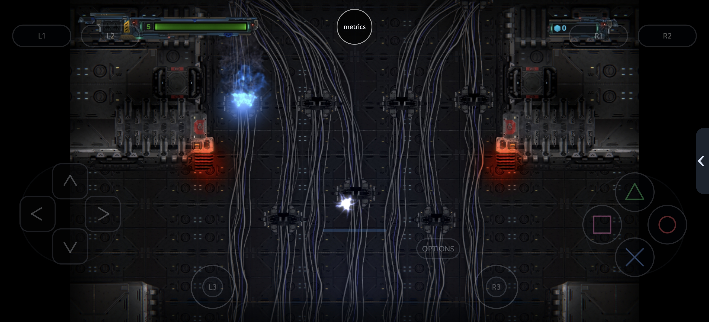<br><sub><b>I, AI</b></sub></td>
  </tr>
  <tr>
    <td align="center" width="50%"><br><sub><b>Spider: Rite of the Shrouded Moon</b></sub></td>
    <td align="center" width="50%"><br><sub><b>Dead Cells</b></sub></td>
  </tr>
  <tr>
    <td align="center" width="50%"><br><sub><b>Rogue Legacy 2</b></sub></td>
    <td align="center" width="50%"><br><sub><b>Hyper Light Drifter</b></sub></td>
  </tr>
  <tr>
    <td align="center" width="50%">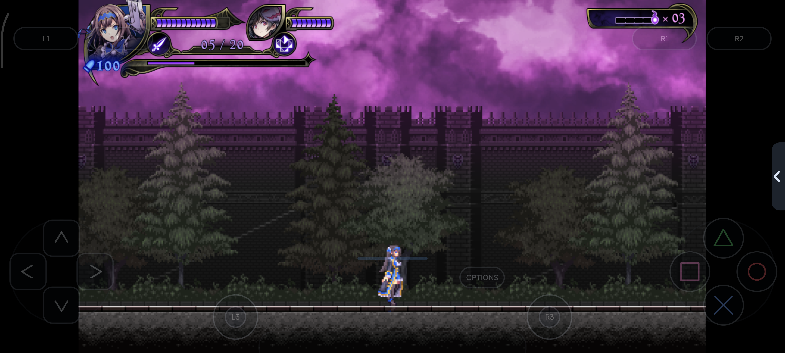<br><sub><b>Grim Guardians: Demon Purge</b> · Poco Snapdragon 8 Gen 3</sub></td>
    <td align="center" width="50%"><br><sub><b>Dark Devotion</b></sub></td>
  </tr>
  <tr>
    <td align="center" width="50%"><br><sub><b>Rain World</b></sub></td>
    <td align="center" width="50%"><br><sub><b>Owlboy</b></sub></td>
  </tr>
  <tr>
    <td align="center" width="50%"><br><sub><b>Islets</b></sub></td>
    <td align="center" width="50%">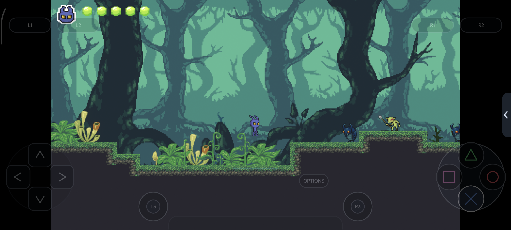<br><sub><b>Thornkin</b> · Poco Snapdragon 8 Gen 3</sub></td>
  </tr>
  <tr>
    <td align="center" width="50%"><br><sub><b>Axiom Verge 2</b></sub></td>
    <td align="center" width="50%"><br><sub><b>Carto</b></sub></td>
  </tr>
  <tr>
    <td align="center" width="50%"><br><sub><b>Dandara</b></sub></td>
    <td align="center" width="50%">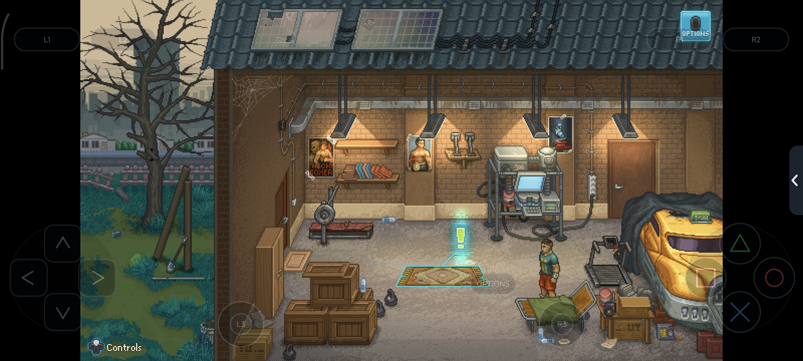<br><sub><b>Punch Club 2: Fast Forward</b> · Poco Snapdragon 8 Gen 3</sub></td>
  </tr>
  <tr>
    <td align="center" width="50%">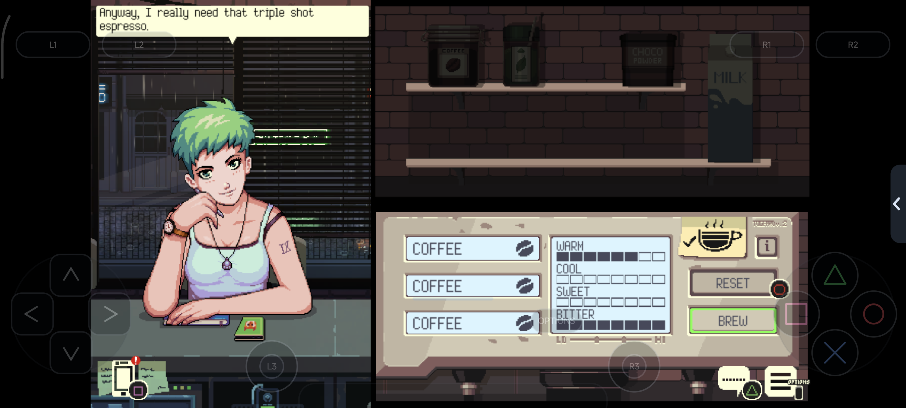<br><sub><b>Coffee Talk</b> · Poco Snapdragon 8 Gen 3</sub></td>
    <td align="center" width="50%"><br><sub><b>Chained Echoes</b></sub></td>
  </tr>
  <tr>
    <td align="center" width="50%"><br><sub><b>The Messenger</b></sub></td>
    <td align="center" width="50%"><br><sub><b>Cyber Shadow</b></sub></td>
  </tr>
  <tr>
    <td align="center" width="50%">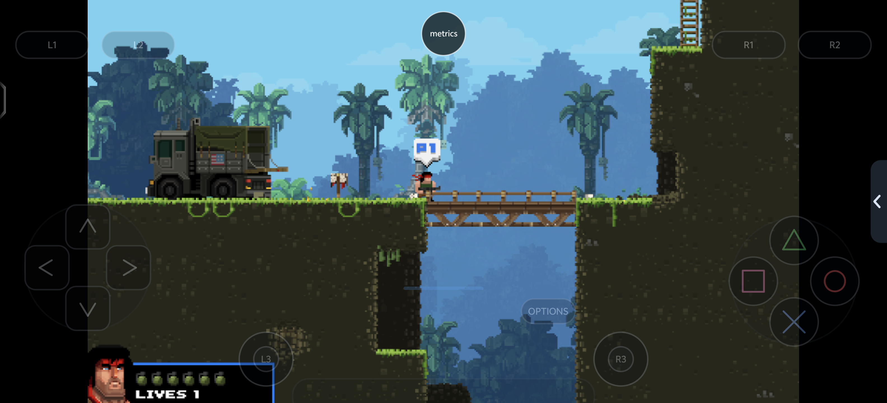<br><sub><b>Broforce</b></sub></td>
    <td align="center" width="50%"><br><sub><b>Fight'N Rage</b></sub></td>
  </tr>
  <tr>
    <td align="center" width="50%"><br><sub><b>Farlands Journey</b></sub></td>
    <td align="center" width="50%">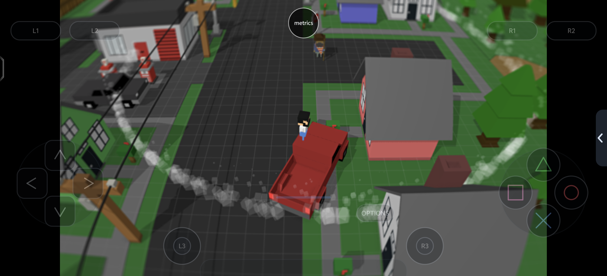<br><sub><b>Don&#39;t Bite Me Bro!</b></sub></td>
  </tr>
  <tr>
    <td align="center" width="50%"><br><sub><b>void tRrLM();++ //Void Terrarium++</b></sub></td>
    <td align="center" width="50%"><br><sub><b>Might &amp; Magic: Clash of Heroes</b></sub></td>
  </tr>
  <tr>
    <td align="center" width="50%"><br><sub><b>Despot's Game</b></sub></td>
    <td align="center" width="50%"><br><sub><b>Lucy Dreaming</b></sub></td>
  </tr>
  <tr>
    <td align="center" width="50%"><br><sub><b>Turnip Boy Commits Tax Evasion</b></sub></td>
    <td align="center" width="50%"><br><sub><b>Sonic Mania</b></sub></td>
  </tr>
  <tr>
    <td align="center" width="50%"><br><sub><b>Shovel Knight</b></sub></td>
    <td align="center" width="50%"><br><sub><b>Hillbilly Doomsday</b></sub></td>
  </tr>
  <tr>
    <td align="center" width="50%">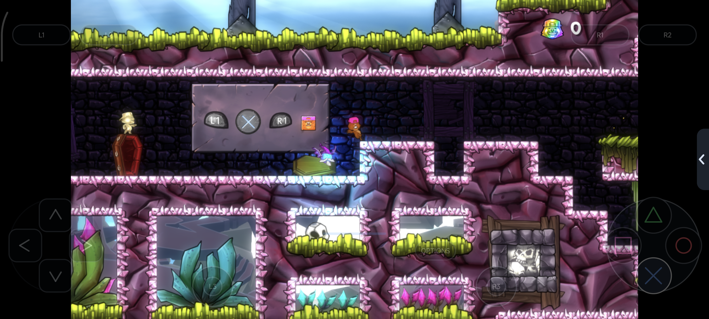<br><sub><b>Super Rude Bear Resurrection</b> · Poco Snapdragon 8 Gen 3</sub></td>
    <td align="center" width="50%">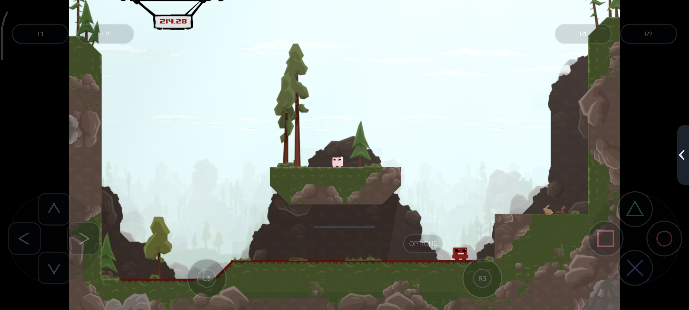<br><sub><b>Super Meat Boy!</b> · Poco Snapdragon 8 Gen 3</sub></td>
  </tr>
  <tr>
    <td align="center" width="50%">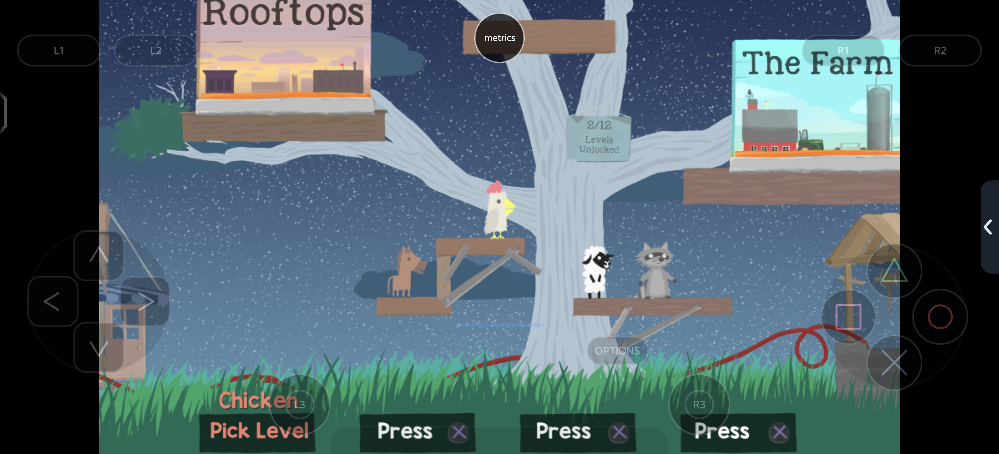<br><sub><b>Ultimate Chicken Horse</b></sub></td>
    <td align="center" width="50%"><br><sub><b>Toto Temple Deluxe</b></sub></td>
  </tr>
  <tr>
    <td align="center" width="50%"><br><sub><b>Perfect Universe</b></sub></td>
    <td align="center" width="50%"><br><sub><b>Limbo</b></sub></td>
  </tr>
  <tr>
    <td align="center" width="50%">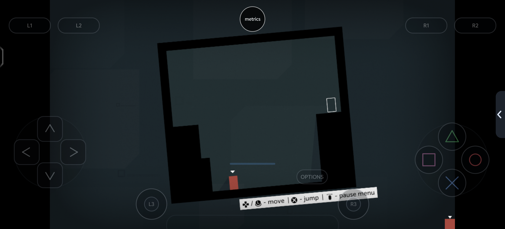<br><sub><b>Thomas Was Alone</b></sub></td>
    <td align="center" width="50%"><br><sub><b>GONNER</b></sub></td>
  </tr>
  <tr>
    <td align="center" width="50%"><br><sub><b>Cosmophony</b></sub></td>
    <td align="center" width="50%"><br><sub><b>Just Shapes &amp; Beats</b></sub></td>
  </tr>
  <tr>
    <td align="center" width="50%"><br><sub><b>The Binding of Isaac: Rebirth</b></sub></td>
    <td align="center" width="50%"><br><sub><b>Hotline Miami 2: Wrong Number</b></sub></td>
  </tr>
  <tr>
    <td align="center" width="50%"><br><sub><b>NOT A HERO</b></sub></td>
    <td align="center" width="50%"><br><sub><b>Nuclear Throne</b></sub></td>
  </tr>
  <tr>
    <td align="center" width="50%">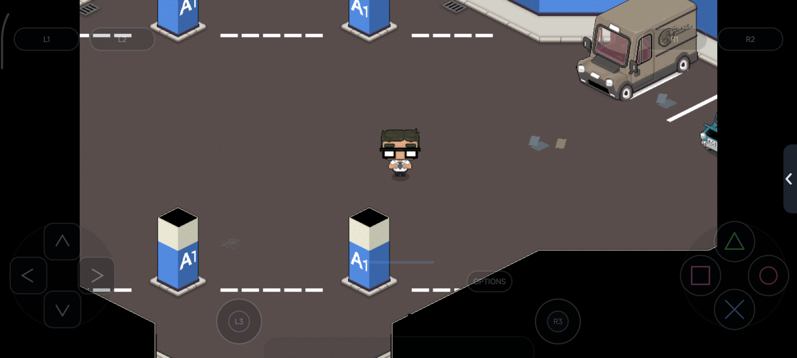<br><sub><b>LEVEL 22</b> · Poco Snapdragon 8 Gen 3</sub></td>
    <td align="center" width="50%"><br><sub><b>Nidhogg 2</b></sub></td>
  </tr>
  <tr>
    <td align="center" width="50%"><br><sub><b>Mega Shoot</b></sub></td>
    <td align="center" width="50%"><br><sub><b>REPLAY: VHS is not dead</b></sub></td>
  </tr>
  <tr>
    <td align="center" width="50%"><br><sub><b>Retrace: Memories of Death</b></sub></td>
    <td align="center" width="50%"><br><sub><b>Dreaming Sarah</b></sub></td>
  </tr>
  <tr>
    <td align="center" width="50%">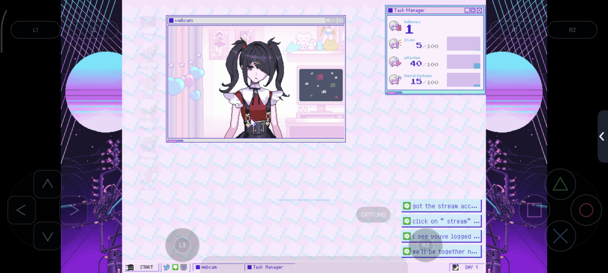<br><sub><b>NEEDY GIRL OVERDOSE</b> · Poco Snapdragon 8 Gen 3</sub></td>
    <td align="center" width="50%"><br><sub><b>Deltarune Chapters 1 &amp; 2</b></sub></td>
  </tr>
  <tr>
    <td align="center" width="50%"><br><sub><b>Undertale</b></sub></td>
    <td align="center" width="50%">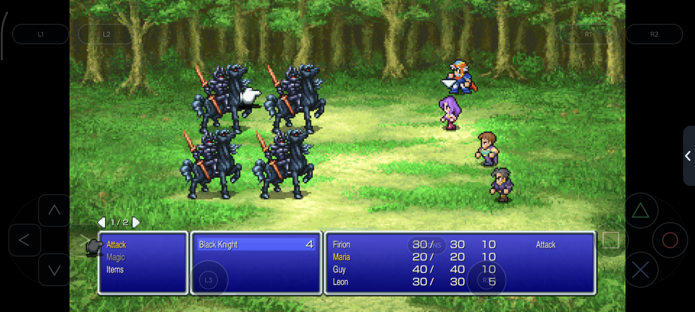<br><sub><b>FINAL FANTASY II</b> · Poco Snapdragon 8 Gen 3</sub></td>
  </tr>
  <tr>
    <td align="center" width="50%"><br><sub><b>FINAL FANTASY</b></sub></td>
    <td align="center" width="50%"><br><sub><b>Another World</b></sub></td>
  </tr>
  <tr>
    <td align="center" width="50%"><br><sub><b>Ninja JaJaMaru Collection</b></sub></td>
    <td align="center" width="50%"><br><sub><b>Downwell</b></sub></td>
  </tr>
  <tr>
    <td align="center" width="50%"><br><sub><b>Nidhogg</b></sub></td>
    <td align="center" width="50%"><br><sub><b>Minit</b></sub></td>
  </tr>
</table>

</details>

The table mirrors the games marked **Playable** in the Vivo test-device library through September 5, 2026.

### Playable compatibility list (102 games)

This list includes only games that have been tested. The broader set of supported games is larger and still requires testing.

<details>
<summary>Show complete compatibility list</summary>

| Game | Playable | Notes |
| --- | :---: | --- |
| Bloodborne | ✅ | |
| The Last of Us Remastered | ✅ | |
| Fear The Spotlight | ✅ | |
| INSIDE | ✅ | |
| Wizordum | ✅ | |
| Hollow Knight | ✅ | |
| Mortisomem | ✅ | |
| Cat From Hell 2 | ✅ | |
| Megaton Rainfall | ✅ | |
| Trine | ✅ | |
| Risk of Rain 2 | ✅ | |
| Rollerdrome | ✅ | |
| Death's Door | ✅ | |
| DREDGE | ✅ | |
| Marble It Up! Ultra | ✅ | |
| The Gardens Between | ✅ | |
| The Pedestrian | ✅ | |
| Going Under | ✅ | |
| FAR: Lone Sails | ✅ | |
| Orc Slayer | ✅ | |
| Jazzpunk: Director's Cut | ✅ | |
| MediEvil | ✅ | |
| FATE Reawakened | ✅ | |
| Buildest | ✅ | |
| Besiege | ✅ | |
| Bluey's Quest for the Gold Pen | ✅ | |
| Fluster Cluck | ✅ | |
| Super Monkey Ball: Banana Blitz | ✅ | |
| Can't Drive This | ✅ | |
| A Short Hike | ✅ | |
| Old Man's Journey | ✅ | |
| Nubla | ✅ | |
| Bonfire Peaks | ✅ | |
| A Monster's Expedition | ✅ | |
| MEGALAN 11 | ✅ | |
| Grand Prix RockN Racing | ✅ | |
| Rock 'N Racing Off Road DX | ✅ | |
| Absolute Drift | ✅ | |
| WHAT THE GOLF? | ✅ | |
| Lethal League Blaze | ✅ | |
| RESOGUN | ✅ | |
| I, AI | ✅ | |
| Spider: Rite of the Shrouded Moon | ✅ | |
| Dead Cells | ✅ | |
| Rogue Legacy 2 | ✅ | |
| Hyper Light Drifter | ✅ | |
| Grim Guardians: Demon Purge | ✅ | |
| Dark Devotion | ✅ | |
| Rain World | ✅ | |
| Owlboy | ✅ | |
| Islets | ✅ | |
| Thornkin | ✅ | |
| Axiom Verge 2 | ✅ | |
| Carto | ✅ | |
| Dandara | ✅ | |
| Punch Club 2: Fast Forward | ✅ | |
| Coffee Talk | ✅ | |
| Chained Echoes | ✅ | |
| The Messenger | ✅ | |
| Cyber Shadow | ✅ | |
| Broforce | ✅ | |
| Fight'N Rage | ✅ | |
| Farlands Journey | ✅ | |
| Don't Bite Me Bro! | ✅ | |
| void tRrLM();++ //Void Terrarium++ | ✅ | |
| Might & Magic: Clash of Heroes | ✅ | |
| Despot's Game | ✅ | |
| Lucy Dreaming | ✅ | |
| Turnip Boy Commits Tax Evasion | ✅ | |
| Sonic Mania | ✅ | |
| Shovel Knight | ✅ | |
| Hillbilly Doomsday | ✅ | |
| Super Rude Bear Resurrection | ✅ | |
| Super Meat Boy! | ✅ | |
| Ultimate Chicken Horse | ✅ | |
| Toto Temple Deluxe | ✅ | |
| Perfect Universe | ✅ | |
| Limbo | ✅ | |
| Thomas Was Alone | ✅ | |
| GONNER | ✅ | |
| Cosmophony | ✅ | |
| Just Shapes & Beats | ✅ | |
| The Binding of Isaac: Rebirth | ✅ | |
| Hotline Miami 2: Wrong Number | ✅ | |
| NOT A HERO | ✅ | |
| Nuclear Throne | ✅ | |
| LEVEL 22 | ✅ | |
| Nidhogg 2 | ✅ | |
| Mega Shoot | ✅ | |
| REPLAY: VHS is not dead | ✅ | |
| Retrace: Memories of Death | ✅ | |
| Dreaming Sarah | ✅ | |
| NEEDY GIRL OVERDOSE | ✅ | |
| Deltarune Chapters 1 & 2 | ✅ | |
| Undertale | ✅ | |
| FINAL FANTASY II | ✅ |  |
| FINAL FANTASY | ✅ | |
| Another World | ✅ | |
| Ninja JaJaMaru Collection | ✅ | |
| Downwell | ✅ | |
| Nidhogg | ✅ | |
| Minit | ✅ | |

</details>

## Contributing

Contributions are welcome. Bug reports, compatibility results, performance traces, and focused pull requests are especially useful. Please open an issue before starting a substantial architectural change.

## Repository layout

| Path | Purpose |
| --- | --- |
| `android-app/` | LSX4 Android application |
| `src/` | LSX4 client-owned native translation and Android runtime sources |
| `externals/` | Native build dependencies |
| `cmake/` | Android native build support |
| `scripts/` | Android dependency build helpers |
| `funnel-arm/` | Android/ARM-adapted emulation layer and authoritative native source profile; desktop distributions and duplicate externals are intentionally absent |
| `assets/` | Project artwork |

## Android application

```sh
cd android-app
./gradlew assembleDebug
```

The debug-only test mode can package a locally owned, decrypted NGS2 module from a
shad4pc `sys_modules` directory:

```sh
./gradlew assembleDebug -Pshad4pcNgs2Module=/path/to/shad4pc/user/sys_modules/libSceNgs2.sprx
```

`SHAD4PC_NGS2_MODULE` provides the same path through the environment. The module is
never included in release assets. LSX4 records the hash of a module installed by test
mode and removes only that managed copy when test mode is disabled or a release build
is launched; a module imported by the user is left untouched.

## Native runtime

```sh
git submodule update --init --recursive
powershell -File scripts/build-ffmpeg-android-pic.ps1
cmake --preset android-arm64-release
cmake --build --preset android-arm64-release
```

The native ownership boundary and optimization strategy are documented in
[`docs/arm_desktop_client_layer_architecture.md`](docs/arm_desktop_client_layer_architecture.md).
