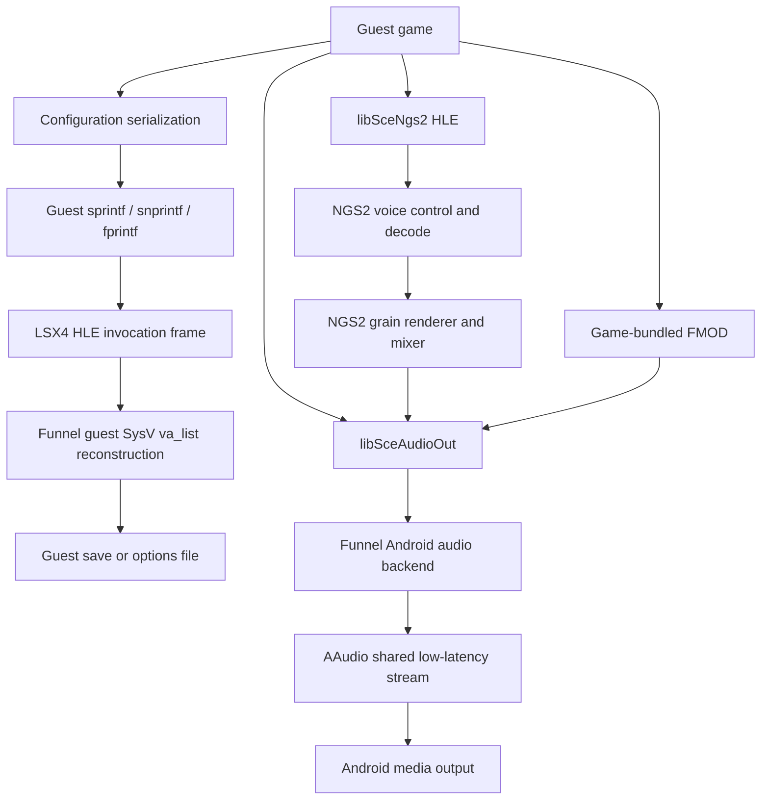

# Android Audio Compatibility Postmortem

## Scope and final status

This document records the Android audio failures investigated across Nidhogg, Shovel
Knight, Owlboy, Dead Cells, and Bloodborne. Similar user-visible symptoms came from
three different layers and must not be treated as one bug:

1. incomplete x86-64 System V variadic-argument reconstruction corrupted
   floating-point values written to game configuration files;
2. a game could retain a previously corrupted zero-volume options file after the
   runtime had been corrected;
3. the NGS2 HLE renderer had incomplete voice-format handling and consumed the
   render buffer capacity instead of the configured NGS2 grain.

The final observed status on Vivo was:

| Title | Final status | Owning fault class |
| --- | --- | --- |
| Nidhogg 1 | Audio working | HLE variadic ABI/configuration |
| Nidhogg 2 | Audio already working; retained as a control | None in this investigation |
| Shovel Knight | Audio works on first start, before entering or saving audio settings | HLE variadic ABI/default configuration |
| Owlboy | Audio and music defaults remain nonzero after removal of the stale options file | Persisted game state created while formatting was broken |
| Dead Cells (`CUSA10484`) | Effects, music, ambience, and voices sound correct | NGS2 HLE format, resampling, and render-grain contract |
| Bloodborne (`CUSA03173`) | Audio remained available | FMOD/AudioOut control path |
| Android virtual controls | No host key-click sound | Android client UI policy |

Recorded against:

- LSX4 repository HEAD `fb006616e66101cb9ccc660ab4370670fcb177f1` plus the current uncommitted worktree;
- Funnel ARM repository HEAD `ec8bae673db8df270488ccc1fb9037eefde92a39` plus the current uncommitted worktree;
- verified native library SHA-256
  `ED18A55DAADED4F5DFBCD454A2920D4ABF281667FB854C71D673CDB02DB8EE3A`;
- verification device: Vivo `V2546A`, Adreno;
- verification date: 2026-07-24.

Line numbers below refer to this snapshot. Function and symbol names are the durable
references if later changes move the lines.

## Runtime stacks

The affected titles do not all use the same audio middleware.



The configuration stack explains Nidhogg 1 and Shovel Knight, and explains how
Owlboy acquired a persistent zero-volume file. The NGS2 stack explains Dead Cells.
Bloodborne exercises the FMOD branch and was therefore a useful negative control.

## Shared case: floating-point values became zero in game options

### Symptoms

- One or more games opened with music and sound-effect volume at zero.
- Entering the game's settings and selecting **Set to default** could make audio
  start immediately.
- Shovel Knight initially required that operation on every fresh start.
- Owlboy visibly reset its own music and sound sliders to `0%`.
- Host audio was enabled and the Android output stream could be opened, so this
  was not an AAudio device-selection failure.

### Fault stack

```text
guest configuration code
  -> guest sprintf/snprintf/fprintf with %f/%g
  -> translated HLE call
  -> only a partial set of XMM arguments reached the runtime context
  -> synthetic guest va_list lacked the complete 176-byte SysV register-save area
  -> floating conversion read zero or the wrong slot
  -> game saved a syntactically valid zero-volume value
  -> later launches loaded silence as an intentional game setting
```

The critical distinction is that AudioOut did not reset the game sliders. The
game persisted the zero values because its formatted configuration data was wrong.
This also explains why manually resetting settings appeared to "activate" sound.

### Working general solution

The fix reconstructs the complete x86-64 System V variadic state instead of adding
title-specific volume overrides:

- [`src/executor/dynamic_translation/hle_invocation_frame.h`](../src/executor/dynamic_translation/hle_invocation_frame.h),
  `HleInvocationFrame`, line 13: retain all eight floating argument lanes;
- [`src/executor/dynamic_translation/retiring_execution_core.cpp`](../src/executor/dynamic_translation/retiring_execution_core.cpp),
  `TryExecuteJitDirectHle`, lines 27697-27718: capture XMM0-XMM7 from guest state;
- [`src/executor/native_runtime_api.cpp`](../src/executor/native_runtime_api.cpp),
  `executor_live_get_current_hle_floating_arguments`, lines 5185-5197: expose the
  current thread's floating arguments to Funnel;
- [`funnel-arm/src/core/aerolib/stubs.cpp`](../funnel-arm/src/core/aerolib/stubs.cpp),
  `ExecutorDirectGuestVaList`, lines 6663-6698: construct the 176-byte register-save
  area with six general-purpose slots and eight 16-byte floating-point slots;
- the same Funnel file, `ExecutorLibcVasprintf`, lines 6472-6506: advance
  `gp_offset`, `fp_offset`, and `overflow_arg_area` according to the guest ABI;
- the same Funnel file, `ExecutorLibcFprintf`, `ExecutorLibcSnprintf`, and
  `ExecutorLibcSprintf`, lines 6728-6742 and 7028-7039: use the shared guest
  `va_list` builder rather than incomplete local arrays.

This is a cross-layer ABI fix. Reducing the captured lanes back to four, packing
floating values at 8-byte rather than 16-byte intervals, or pointing
`overflow_arg_area` at the host stack will recreate the defect.

### Regression checks

1. Start a title with no existing options file.
2. Confirm that default music and effects are audible before opening settings.
3. Inspect the game's sliders; defaults must be nonzero.
4. Restart without saving settings and confirm the same result.
5. Save a non-default floating volume, restart, and verify exact persistence.
6. Exercise a format string containing both integer and floating conversions so
   GP and FP offset advancement are tested together.

## Nidhogg 1

### Observed symptom

Nidhogg 1 was silent. Nidhogg 2 was explicitly tested separately and already
worked, so the two titles must not be conflated.

### Stack

```text
Nidhogg 1 startup/options initialization
  -> formatted floating-point configuration values
  -> LSX4 direct HLE boundary
  -> Funnel libc formatted-output HLE
  -> persisted audio levels
  -> game audio mixer
  -> libSceAudioOut
  -> AAudio
```

### Working solution

The complete eight-lane HLE floating-argument path and correctly laid-out guest
`va_list` fixed the title. No title ID check, forced gain, or Nidhogg-specific
fallback was added.

### Rejected diagnoses

- Nidhogg 2's previous-frame flicker fix is unrelated.
- A missing NGS2 firmware module is unrelated to this title's confirmed path.
- Forcing AudioOut gain would only hide the bad persisted/configured value and
  would violate guest mute semantics.

## Shovel Knight

### Observed symptom

On initial launch the game was silent. Opening audio settings and selecting
**Set to default** made sound work. An intermediate state worked only after the
settings had been saved; the required behavior was audio before any settings visit
or save.

### Stack

```text
first-run default option construction
  -> guest formatted libc call with floating values
  -> translated HLE argument capture
  -> guest SysV va_list reconstruction
  -> initial in-memory audio configuration
  -> game mixer
  -> libSceAudioOut
  -> AAudio
```

### Working solution

The shared variadic ABI fix restored the first-run default values. The accepted
result does not depend on an existing options file or the settings reset action.
The AudioOut port itself also starts at PS4 unity gain in
[`funnel-arm/src/core/libraries/audio/audioout.cpp`](../funnel-arm/src/core/libraries/audio/audioout.cpp),
`OpenPort`, line 396, and applies that value to the backend at line 436. This is
normal platform behavior, not a Shovel Knight override.

### Regression checks

- Test with the title's options removed.
- Do not enter settings before checking title-screen and gameplay audio.
- Restart once without saving, then once after changing and saving a non-default
  volume.

## Owlboy

### Observed symptom

Owlboy repeatedly presented both music and sound volume as `0%`. Correcting the
runtime alone did not alter the already persisted values.

### Root cause

This was a two-stage failure:

1. the earlier incomplete floating-point variadic path allowed zero values to be
   serialized;
2. Owlboy then correctly reloaded those values from its existing options state.

There was no evidence that Owlboy continued to force valid nonzero values back to
zero after the runtime fix and a clean options regeneration.

### Working solution

Keep the shared HLE ABI correction, then remove only Owlboy's persisted options
file from its own save data once. On the next launch the game regenerates nonzero
defaults. The exact device-side filename can vary with title build and save layout;
identify it from the title's mounted save directory instead of deleting the whole
application data or other games' saves.

No emulator source was rolled back and no Owlboy-specific code path was added.

### Regression checks

- Back up the title save before manipulating options.
- Remove only the options artifact, launch, and confirm nonzero defaults.
- Restart twice to distinguish correct persistence from a one-run fallback.
- Do not treat deletion as the product fix; it is cleanup for state produced by
  the old runtime.

## Dead Cells

### Symptoms and progression

Dead Cells had two successive failures:

1. the game was initially completely silent;
2. after NGS2 voice support was added, effects became correct but music, ambience,
   and voices were rough, growling, and temporally inaccurate.

Runtime measurements for the second failure showed:

```text
[LSX4_NGS2_RENDER] bytes=32768 frames=4096 channels=2 waveform=0x18
                   systemRate=48000 grain=256
```

The active streaming PCM voice used stereo S16 data at 44.1 kHz. A representative
block was 16,384 bytes / 4,096 frames. Larger observed voices included 359,200-byte
/ 89,800-frame and 179,600-byte / 44,900-frame blocks.

### Fault stack

```text
Dead Cells NGS2 commands
  -> sceNgs2VoiceControl
  -> canonical sampler/submixer parameter decoding
  -> PCM waveform decoding and streaming callbacks
  -> 44.1 kHz to 48 kHz voice resampling
  -> sceNgs2SystemRender
  -> configured 256-frame NGS2 grain
  -> game forwards the rendered grain to libSceAudioOut
  -> 256-frame AAudio output at 48 kHz
```

Before the final fix, `sceNgs2SystemRender` treated the full 4,096-frame buffer
capacity as the requested render length. The game consumed or forwarded only the
configured 256-frame grain. The HLE runtime therefore decoded and advanced up to
sixteen grains per call while fifteen grains of temporal progress were discarded.
Streaming callbacks and block changes occurred every 10-20 ms instead of roughly
100-120 ms, producing the rough, accelerated, discontinuous music and voices.

### Working solution

The accepted result is the combination of these general NGS2 contracts:

1. **Canonical parameter identifiers.**
   [`funnel-arm/src/core/libraries/ngs2/ngs2_runtime.cpp`](../funnel-arm/src/core/libraries/ngs2/ngs2_runtime.cpp),
   lines 55-82, recognizes canonical sampler IDs `0x40010000` through
   `0x40010005`, submixer ID `0x20010000`, and normalizes legacy aliases.
2. **Canonical PCM waveform formats.**
   The same file, lines 45-52 and 85-111, handles S8 `0x11`, S16 `0x12`,
   S24 `0x13`, S32 `0x14`, F32 `0x18`, plus the legacy PCM aliases.
   `DecodePcmFrame`, lines 888-940, converts each supported format without
   changing guest block stride semantics.
3. **Continuous resampling state.**
   `VoiceState`, lines 254-259, retains the current frame, next frame, and
   fractional phase. `MixVoice`, lines 1187-1257, linearly interpolates across
   frame and streaming-callback boundaries instead of dropping fractional source
   progress.
4. **Render-grain bound.**
   `Ngs2Runtime::Render`, lines 648-688, renders
   `min(buffer_capacity, system.grain_samples)` frames. It still clears the full
   output capacity, so unused space cannot leak stale samples.
5. **Real HLE entry-point delegation.**
   [`funnel-arm/src/core/libraries/ngs2/ngs2.cpp`](../funnel-arm/src/core/libraries/ngs2/ngs2.cpp),
   `sceNgs2SystemRender`, lines 552-555, and `sceNgs2VoiceControl`, lines 592-594,
   delegate to the runtime instead of returning success from empty stubs.

The render-grain bound was the decisive quality fix. Linear resampling improved
sample-rate conversion but did not by itself eliminate the distortion.

### Diagnostic dead ends and incomplete attempts

- Installing `libSceNgs2.sprx` was investigated. No firmware NGS2 module was
  present in the tested Vivo `sys_modules` directory; the final accepted run used
  the built-in HLE runtime.
- The unimplemented filter parameter `0x40001300`, type 9, was observed and
  considered, but it was not required for the accepted fix and was not represented
  as implemented.
- Historical removed AudioFlinger tracks showed thousands of underruns. The
  currently active track after the fix reported zero underruns, so old removed-track
  counters were not evidence for the final defect.
- Increasing AAudio capacity, changing gain, or adding silence does not correct a
  renderer that advances sixteen times too far.

### Regression checks

1. Confirm effects, background ambience, music, and voices separately.
2. Log `bufferSize`, capacity-derived frames, configured grain, sample rate,
   channel count, and waveform type.
3. Require decoded source progress per render call to match the configured grain,
   not the destination allocation capacity.
4. Exercise both 44.1 kHz and 48 kHz voices and a block transition.
5. Inspect only the active AudioFlinger/AAudio track when evaluating underruns.

## Bloodborne

### Observed result

Bloodborne audio was present during this investigation. It remained a control for
the ordinary game-middleware path while the NGS2 and configuration cases were
being changed.

### Stack

```text
Bloodborne guest audio / FMOD mixer
  -> game-bundled middleware threads
  -> libSceAudioOut
  -> Funnel Android audio backend
  -> AAudio
```

The observed FMOD mixer thread can be CPU-intensive, but CPU cost is not evidence
of silence or the Dead Cells NGS2 grain defect.

### Non-regression rule

Do not route all titles through NGS2, force global nonzero volume, or bypass guest
mute calls to repair another title. Bloodborne must continue to exercise its
existing FMOD/AudioOut route unchanged.

## Android output hardening

### AAudio backend

[`funnel-arm/src/core/libraries/audio/sdl_audio_out.cpp`](../funnel-arm/src/core/libraries/audio/sdl_audio_out.cpp),
`AndroidAAudioPortBackend`, lines 578-809, owns the Android output route:

- shared low-latency AAudio stream;
- requested guest sample rate;
- mono or stereo host output;
- floating-point host samples;
- bounded blocking write;
- SDL fallback if AAudio cannot be opened.

`SetVolume`, lines 651-659, derives host gain from the active guest channel gains
and the application volume slider. It must preserve an intentional guest zero.

### Eight-channel downmix

`ConvertToOutput`, lines 718-784, downmixes an eight-channel guest stream to stereo
instead of copying only the first two channels. Center and surround content are
mixed at approximately -3 dB. This prevents dialogue, music, or effects assigned
outside FL/FR from disappearing on a stereo Android device.

### Silent-buffer keepalive

`Output`, lines 599-627, inserts an inaudible alternating `1e-8` sample only when
the entire converted buffer is exactly zero. This keeps vendor audio paths from
treating an active stream as permanently idle without making muted guest audio
audible. It is output-path hardening, not a substitute for valid game volume,
format decoding, or NGS2 timing.

## Android overlay key-click sound

### Symptom

Touching virtual controller buttons produced an Android UI click unrelated to
guest audio.

### Working solution

Sound effects are disabled on the overlay containers and interactive controller
views in
[`android-app/app/src/main/java/app/lsx4/android/MainActivity.java`](../android-app/app/src/main/java/app/lsx4/android/MainActivity.java),
lines 2334, 2341, 3042, and 4972. Haptic feedback remains independent and may
continue to provide touch confirmation.

## Firmware-module and test-mode diagnostics

The Android settings UI can import a user-provided decrypted
`libSceNgs2.sprx` into the application's `lsx4-home/sys_modules` directory. Debug
test mode can manage a bundled copy only when the build was explicitly configured
with one. These paths are diagnostic or compatibility alternatives and do not
change the final Dead Cells finding: the verified fix ran through the built-in
NGS2 HLE implementation.

Never bundle or distribute a copyrighted firmware module as part of the normal
runtime. A missing module must not be used to explain a failure until logs show
that the title actually selected the module path rather than the registered HLE
library.

## Diagnostic markers

Use the following markers to identify the owning layer:

| Marker | Interpretation |
| --- | --- |
| `[EXECUTOR_LIBC_FORMATTED]` | Guest format string and formatted result; use for zero-volume persistence |
| `[EXECUTOR_LIBC_FPRINTF]` | Direct guest `fprintf` HLE path |
| `[LSX4_AUDIO_STATE]` | AudioOut port/open/host-output state |
| `[LSX4_AUDIO_VOLUME]` | Guest `sceAudioOutSetVolume` requests |
| `[EXECUTOR_AUDIO_AAUDIO_OPEN]` | AAudio open parameters or SDL fallback |
| `[EXECUTOR_AUDIO_AAUDIO_OUTPUT]` | Host writes and peak level |
| `[LSX4_NGS2_ROUTE]` | Voice matrix routing |
| `[LSX4_NGS2_VOLUME]` | NGS2 voice-port gain |
| `[LSX4_NGS2_MIX]` | Effective route and voice volume |
| `[LSX4_NGS2_AUDIO]` | Nonzero mixed NGS2 output |
| `[LSX4_NGS2_RENDER]` | Output capacity, format, system rate, and grain |

Interpret them in order. A nonzero NGS2 peak with a zero AudioOut gain is a
different failure from a silent NGS2 decoder, and a valid AAudio write cannot
repair configuration data that intentionally requests zero volume.

## Triage decision tree

1. **Does the Android audio probe produce sound?**
   If no, diagnose the host AudioOut/AAudio route first.
2. **Does `[EXECUTOR_AUDIO_AAUDIO_OPEN]` report a live stream?**
   If no, diagnose stream creation or SDL fallback.
3. **Does the game call `[LSX4_AUDIO_VOLUME]` with zero?**
   If yes, inspect guest configuration and formatted output before touching gain.
4. **Do the game's own sliders show zero after a clean first run?**
   Inspect the HLE variadic path. If the runtime is already fixed, isolate and
   regenerate only that title's options artifact.
5. **Is the title using NGS2?**
   Compare canonical parameter IDs, waveform formats, route matrix, source rate,
   and configured grain.
6. **Are effects correct but music/voices rough?**
   Compare decoder progress to the NGS2 grain. Do not infer an AAudio underrun from
   old removed tracks.
7. **Is an eight-channel guest stream audible only partially?**
   Verify the stereo downmix path rather than raising global gain.

## Non-regression rules

- Do not add title-name, title-ID, or byte-signature audio fixes.
- Do not force nonzero volume after a valid guest mute request.
- Do not delete all application data to repair one title's options.
- Do not reduce guest HLE floating arguments below XMM0-XMM7.
- Do not use host `va_list` layout for a guest x86-64 System V call.
- Do not render NGS2 buffer capacity when the configured grain is smaller.
- Do not reset resampler phase at ordinary streaming block boundaries.
- Do not infer current underruns from removed historical AudioFlinger tracks.
- Keep audio pacing event-driven; do not add polling loops or fixed game-specific
  delays.
- After changing any shared audio layer, retest Nidhogg 1, Shovel Knight first-run,
  Owlboy persistence, Dead Cells effects and music, and Bloodborne as the FMOD
  control.
