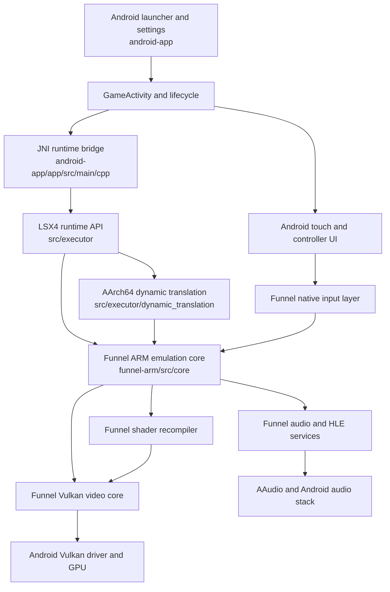

# ARM Desktop and Android Client Layer Architecture

## Decision

LSX4 has two explicit native ownership layers:

- Funnel ARM owns the ARM-adapted desktop/emulation implementation.
- The LSX4 repository owns the Android client, runtime bridge, and dynamic translation implementation.

The Android native target must not compile a second desktop/emulation copy from the LSX4 client tree. The build fails when a desktop source escapes Funnel ownership.

This boundary was verified on 2026-07-24 with a clean CMake regeneration, a native rebuild, APK installation, on-device SHA-256 verification, and a Bloodborne (`CUSA03173`) launch on Vivo.

## Physical ownership

| Owner | Path | Responsibilities |
| --- | --- | --- |
| Funnel ARM | `funnel-arm/src/common` | Shared primitives, configuration, logging, memory utilities, decoder support, and the iced-x86 FFI crate |
| Funnel ARM | `funnel-arm/src/core` | PS4 kernel/HLE libraries, loader, memory, modules, audio, input-facing guest services, and process lifecycle |
| Funnel ARM | `funnel-arm/src/video_core` | AMDGPU command processing, Vulkan renderer, presentation, synchronization, texture/buffer caches, and host shaders |
| Funnel ARM | `funnel-arm/src/shader_recompiler` | Guest shader decoding, IR, optimization passes, and SPIR-V emission |
| Funnel ARM | `funnel-arm/src/input` | Native controller and mouse adaptation used by the emulation core |
| Funnel ARM | `funnel-arm/src/imgui` | Native diagnostic UI integration and embedded font resources |
| Funnel ARM | `funnel-arm/src/runtime_resources` | Native embedded trophy resources |
| Funnel ARM | `funnel-arm/src/emulator.*`, `funnel-arm/src/sdl_window.*` | Emulation entry and native window integration |
| LSX4 client | `src/executor` | AArch64 dynamic translation, runtime API, native artifact cache, process-memory bridge, diagnostics, and fault containment |
| LSX4 client | `android-app` | Android activities, launcher, settings, input overlay, lifecycle, JNI bridge, packaging, and localized UI |
| LSX4 client | `CMakeLists.txt` | Final Android target composition and external dependency integration |

The former client-side desktop snapshot was copied before removal to:

`D:\LProj\PetProj\backup-adapted-desktop-in-client`

The backup contains 813 files. Every copied file was SHA-256 compared with its source before the client duplicates were removed; the verification result was `missing=0, different=0`.

## Build contract

`funnel-arm/cmake/lsx4_arm_desktop_layer.cmake` is the integration manifest. It resolves all desktop source lists to Funnel and validates ownership during CMake configuration.

The include order is intentional:

1. `funnel-arm` resolves legacy includes such as `src/common/types.h`.
2. `funnel-arm/src` resolves includes such as `common/types.h`.
3. Client `src` resolves only `executor/...` headers.

The verified generated build graph contains:

- 321 Funnel-owned C++ objects;
- 47 client-owned `src/executor` C++ objects;
- zero references to removed client desktop source paths.

The iced-x86 Rust bridge is Funnel-owned, while the vendored iced-x86 dependency remains a root external shared by the final target. Embedded native resources and host-shader generation also read from Funnel paths.

## Complete source-use audit

The source tree and the final native link were audited separately. A file being present in the Funnel repository does not imply that the Android application compiles or executes it.

| Funnel area | Files currently present | Objects linked into `liblsx4_executor_android.so` | Android use |
| --- | ---: | ---: | --- |
| `src/common` | 102 | 23 | Active shared runtime primitives |
| `src/core` | 545 | 190 | Active PS4 loader, HLE, process, memory, audio, and kernel services |
| `src/imgui` | 46 | 4 | Active native renderer subset; generated font resources are separate target inputs |
| `src/input` | 6 | 3 | Active native input adaptation |
| `src/shader_recompiler` | 107 | 62 | Active guest shader translation and SPIR-V generation |
| `src/video_core` | 113 | 37 | Active AMDGPU, Vulkan, presentation, and cache implementation |
| `src/emulator.*`, `src/sdl_window.*` | 4 | 2 | Active emulation entry and window/surface integration |
| `src/runtime_resources` | 5 | 0 direct objects | Active through the embedded-resource library |
| `src/dist` | 5 | 0 | Retained desktop packaging material; not linked on Android |
| `src/resources` | 14 | 0 | Retained desktop resources; not linked on Android |
| `src/shadnet` | 5 | 0 | Retained desktop network helper; not linked on Android |
| `src/main.cpp` | 1 | 0 | Retained desktop entry point; not linked on Android |

The final link has exactly 369 project object inputs: 321 from Funnel, 47 from `src/executor`, and one generated `scm_rev.cpp` object under the build directory. It has zero objects from a client-side desktop source tree. The apparently similar `externals/sdl3/src/core/...` paths are SDL implementation files, not a second LSX4/shad4pc emulation core.

The root `externals` directory remains final-target dependency infrastructure (SDL, Vulkan headers, shader tooling, codecs, containers, and similar third-party libraries). It is intentionally not classified as Android client business logic or as a duplicate desktop/emulation implementation. Dependency ownership can be consolidated later, but moving vendored packages would not change the runtime layer boundary and would add submodule risk without a performance benefit.

The pre-removal client snapshot contains 813 files in `D:\LProj\PetProj\backup-adapted-desktop-in-client`. Those files were overlaid into Funnel before deletion. The current Funnel copy differs from that backup only where integration required a path adjustment in `common/iced_x86_ffi/Cargo.toml`; the actual Rust source and dependency version are unchanged. The previously modified `shader_recompiler/ir/position.h` is byte-identical between the backup and Funnel, so the working-tree implementation was preserved rather than replaced by an older committed copy.

## Runtime data flow

At runtime the Android client selects a game and owns lifecycle, permissions, presentation surface, touch/controller overlay, and settings. The executor owns guest x86-64 to AArch64 translation and calls into the Funnel-owned emulation contracts. Funnel owns guest services and turns PS4 GPU work into Vulkan work. Android drivers and the device kernel remain below both project layers.

## Verification evidence

The verified native library was:

- file: `build/android-arm64-release/liblsx4_executor_android.so`;
- size: 51,551,416 bytes;
- SHA-256: `E2A0DEB22C5C578A11228A41EC8F2328FF0B5596367B1C3E7F05F3309B1EFC9C`.

The same hash was measured inside Vivo application storage at `files/runtime/liblsx4_executor_android.so`. In the final audit launch, Bloodborne created live game threads through the AArch64 JIT, exceeded 237,000 persistent-cache hits, opened the AAudio output, submitted Vulkan work, and completed more than 192 frames without a fatal process or Java exception. The device reported `vivo V2546A` and an Adreno Vulkan implementation; Mali results were not used for acceptance.

## Optimization order

### 1. Optimize Funnel ARM first

This is the heavier layer and the first target for profiling because it owns most compiled objects and most CPU/GPU-facing emulation work.

1. Remove Android target work that exists only for desktop UI, desktop discovery, updater, Discord, USB, or unsupported host platforms. Prefer CMake source gating so Funnel can retain desktop code without compiling it into Android.
2. Profile Vulkan submission, fence ownership, command-buffer batching, resource residency, texture conversion, and page-fault paths. Optimize contracts rather than game-specific signatures.
3. Reduce memory duplication between guest memory, buffer cache, texture cache, staging allocations, and shader artifacts. Use residency budgets and generation tracking before adding eviction heuristics.
4. Reduce shader compilation and pipeline creation on gameplay threads through persistent artifacts, asynchronous compilation, canonical pipeline keys, and bounded background work.
5. Audit HLE libraries enabled for Android. Compile or initialize only services reachable by the selected title while preserving lazy symbol resolution and general compatibility.
6. Optimize audio mixing and format conversion after measuring FMOD/AAudio wakeups, buffer size, resampling, and thread affinity. Keep audio timing event-driven.
7. Replace polling or fixed sleeps with completion events only when the guest-visible ordering contract remains intact.

### 2. Optimize the LSX4 client second

1. Use dynamic profiles to remove hot semantic helper transitions through direct AArch64 lowering.
2. Improve register/value residency, direct chaining, native artifact loading, and JIT cache admission without reintroducing source-specific byte signatures.
3. Keep Android lifecycle and JNI calls out of frame-critical loops. Batch UI-to-native settings changes and controller state publication.
4. Make runtime deployment reproducible by recording the `.so` hash used by an APK test and rejecting stale runtime files in debug automation.
5. Preserve the event-driven launch and wait model; address missing completion edges at their owning layer instead of restoring periodic timeouts.

### 3. Optimize cross-layer contracts last

Cross-layer changes require measurements from both sides. The main candidates are translated-call batching, guest-memory ownership, surface/present handoff, shader artifact publication, and controller snapshot publication. Each contract should have one owner, explicit lifetime rules, and counters that distinguish queued work from completed work.

## Non-regression rules

- Do not restore desktop/emulation files under client `src`.
- Do not add a client include path ahead of Funnel for `common`, `core`, `video_core`, `shader_recompiler`, `input`, or `imgui`.
- Do not bypass `lsx4_arm_desktop_layer.cmake` with direct desktop source paths in the root target.
- Build and hash the `.so`, install the APK with data preservation, deploy that exact `.so`, and verify the on-device hash before compatibility testing.
- Test at least native initialization, a cached title launch, live JIT execution, GPU submission, and frame completion after a boundary change.
